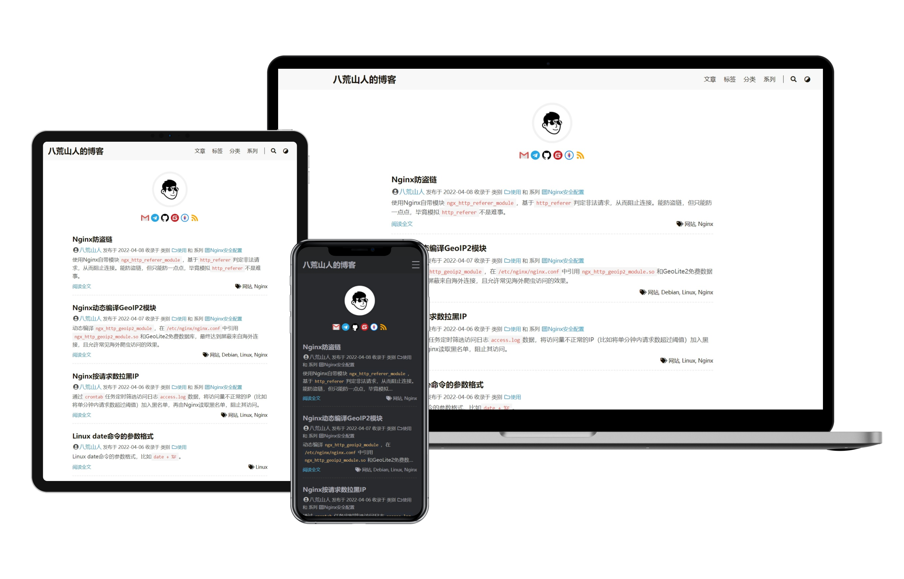

<a href="https://gohugo.io" target="_blank" rel="noopener noreffer"></a> <a href="https://github.com/HEIGE-PCloud/DoIt" target="_blank" rel="noopener noreffer"></a> <a href="https://github.com/zhyoch/blog/blob/master/LICENSE" target="_blank" rel="noopener noreffer"></a> <a href="https://gitee.com/zhyoch/blog" target="_blank" rel="noopener noreffer"></a>

你可以像本项目一样，将 [DoIt](https://github.com/HEIGE-PCloud/DoIt.git) 主题仓库添加为你的网站目录的子模块：

```bash
git submodule add https://github.com/HEIGE-PCloud/DoIt.git themes/DoIt
```

之后, 你可以通过这条命令来将主题更新至最新版本：

```bash
git submodule update --remote --merge
```

---------------------------------------

克隆本项目（含有子模块的项目）时，使用：

```bash
git clone --recurse-submodules https://github.com/zhyoch/blog.git
```

会自动初始化并更新仓库中的每一个子模块， 包括可能存在的嵌套子模块。

如果你已经克隆了项目但忘记了 `--recurse-submodules` ，那么可以运行：

```bash
git submodule update --init
```

如果还要初始化、抓取并检出任何嵌套的子模块，请使用简明的：

```bash
git submodule update --init --recursive
```